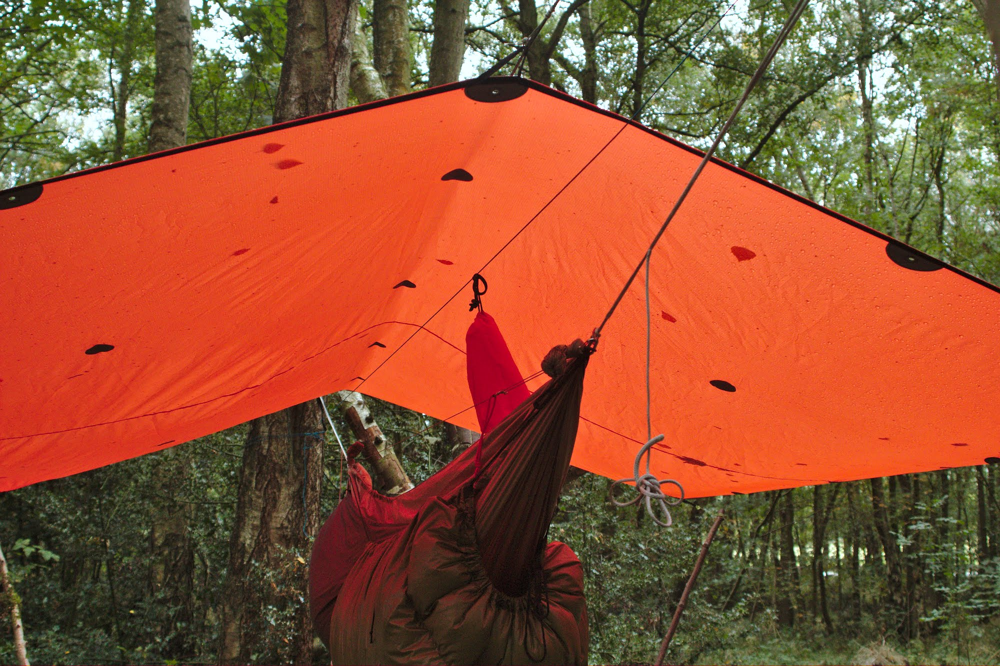

## How I came to be testing an Alpkit tarp

Those who know me know that I'm a massive fan of [Alpkit](https://www.alpkit.com/) gear. When considering the performance you get for the **value for money** it's hard to beat.

No gear is perfect though and after some long term durability issues I was having with two [Rig 7](https://www.alpkit.com/products/rig-7) tarps, and a few of their [Airlok](https://www.alpkit.com/products/airlok-20l) dry bags, I wrote to them with my findings.
The outcome of those conversations resulted in Alpkit asking me to test out a new prototype for the next generation of Rig 7 tarps.

The main differences between this prototype and the regular Rig 7 tarps is the fabric used. The prototype uses a **ripstop polyester fabric instead of the silnylon** of the standard Rig 7. This means there is a weight difference of 68g with the prototype weighing in at 604g with stuff sack and the silnylon Rig 7 weighing 536g with stuff sack.

---

### Issues with silnylon

Silnylon is very lightweight and waterproof so you'd think it a great fabric for tarps and for the most part it is. The issue I find with it is that the bolt sizes of fabric are generally limited to 1.5m width which means on a 2.8m X 2.4m tarp you going to have to have a seam. **Silnylon has a good deal of stretch to the fabric** but where the seam is the fabric does not stretch as much putting a lot of strain on the seam and the seam sealing in particular.
You can see this in the below image, notice how the tarp dips down in the center along the seam when under tension. In addition the stretch in silnylon tarps can lead to puddles forming on your tarp in heavy prolonged rain.

---

### The eventual seam failure

With repeated strain on the seam sealing tape in a relatively short time (heavy frequent use) it looses it's bond to the seam and fails, which brings about another issue with silnylon - repairing it.

Seam sealing fails on all tarps eventually and it's usually no big deal, in the field you can usually easily repair with something like [Stormsure Tuff Tape](https://www.alpkit.com/products/stormsure-tuff-tape) or my long time favourite [McNett Tenacious Tape](https://outdoor.mcnett.eu/outdoor/tenacious-tape/) or even a temporary repair with a decent Duct tape, then do a more permanent repair at home with [McNett Seamgrip](https://outdoor.mcnett.eu/seamgrip/) Not so with silnylon though, hardly anything sticks to it with any kind of half decent waterproof bond. A fairly decent and permanent repair to silnylon can be had using [McNett SilNet](https://outdoor.mcnett.eu/outdoor/sil-net-silicone-seam-sealer/) but it's by no means a field expedient solution and does not solve the issue of the tarp dipping down at the seam (which can get pretty annoying on multiple nights out).

---

### The solution

The solution is to have a tarp with no center seam such as the now very rare or very expensive **Australian army tarp** like in my [Tarp & Hammock Knots](https://bushblade.co.uk/posts/tarp-and-hammock) article. Or use a fabric that has low stretch and is easy to repair. I think for Alpkit they have found that in the use of the new polyester fabric. Polyester has very low stretch compared to nylon, and seems to be following a trend from tent manufacturers in switching fabrics.

---

### Test ongoing

This is to be a long term test of the new fabric and so far I've been using it for almost 6 months at 3 to 4 days use a month and I definitely prefer it over the silnylon (though maybe not the colour choice!). I'm happy to incur the small weight increase in favour of increased durability and better pitching.

If you would like to see more images from my tests so far then check out the [Google Photos](https://photos.app.goo.gl/F5CNKonaQ64nTzYk7) ablum.

